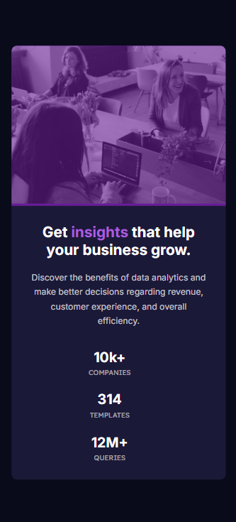

# Frontend Mentor - Solução Stats preview card component

Esta é a solução para o [Stats preview card component challenge on Frontend Mentor](https://www.frontendmentor.io/challenges/stats-preview-card-component-8JqbgoU62). 

## Tabela de Conteúdo

- [Visão Geral](#visão-geral)
  - [O Desafio](#o-desafio)
  - [Screenshot](#screenshot)
  - [Links](#links)
- [Meu Processo](#meu-processo)
  - [Construído com](#Construído-com)
- [Autor](#autor)

## Visão Geral

### O Desafio

Tornar possível paro o usuário:

- Visualizar um layout otimizado dependendo do tamanho de tela do dispositivo.

### Screenshot

Layout Desktop

Layout Mobile

### Links

- URL Solução: [Frontend Mentor](https://www.frontendmentor.io/solutions/stats-preview-card-responsivo-S2usIAObqk)
- URL Site: [Site online](https://evandrobaraka.github.io/stats-preview-card-component/)

## Meu Processo

### Construído com

- HTML5 Semantico
- CSS
- Flexbox

## Autor

- Facebook - [Evandro Passaia](https://www.facebook.com/evandro.passaiaze)
- Frontend Mentor - [@EvandroBaraka](https://www.frontendmentor.io/profile/EvandroBaraka)
- Github - [@EvandroBaraka](https://github.com/EvandroBaraka)
- Linkedin - [Evandro Passaia](https://www.linkedin.com/in/evandro-passaia-62b9a5269/)